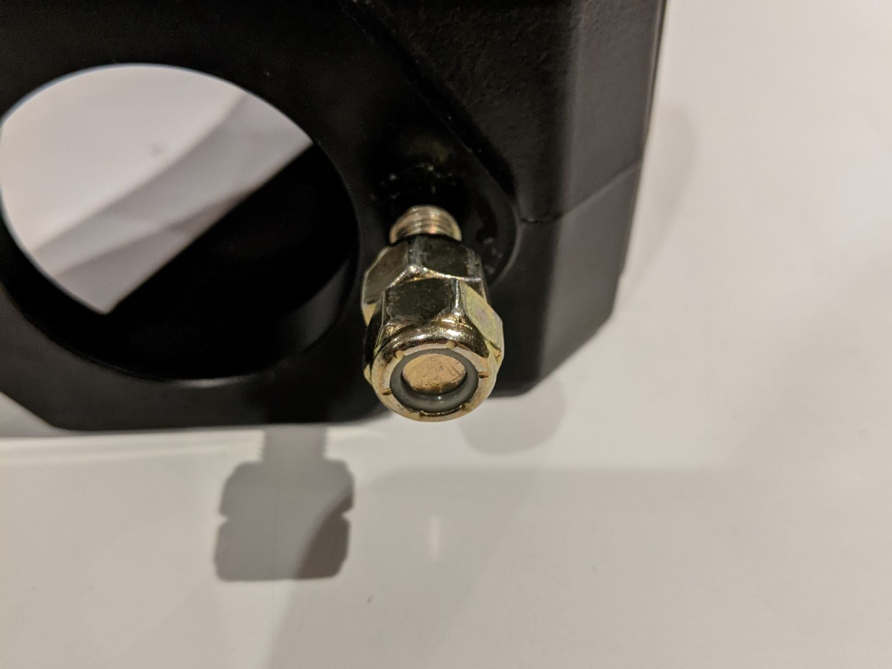
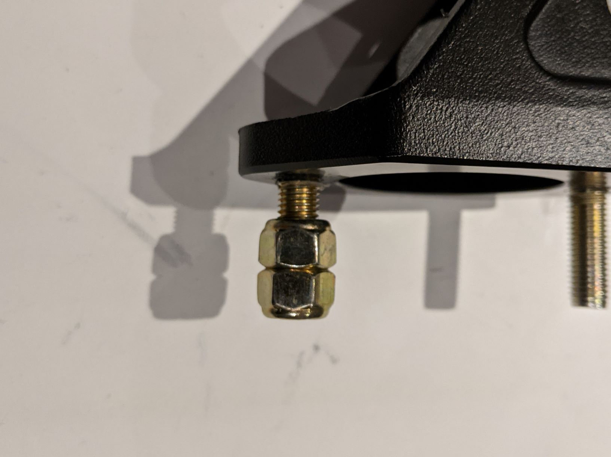

# Assembly
## Clutch Pedal
1. Remove the mounting studs
    - Thread the 5/16-24 lock nuts onto the long size of the mounting stud in a "jamb nut" fashion:
        - Only thead the nut on the end up until the point where the nylon start to grip. This will make it easier to remove later.

            
            
    
    - Using the inner lock nut (closest to the pedal), rotate the mounting stud out of the pedal frame.
        - Loctite was used on the studs so they will require some force
        - **Wear eye protection and gloves to protect your eyes and hands! While unlikely, its possible the nut could slip, the wrench could slip, or the stud could shear!**
    - Cut the mild steal according to the template
