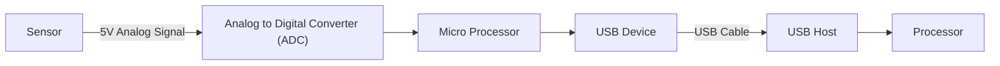
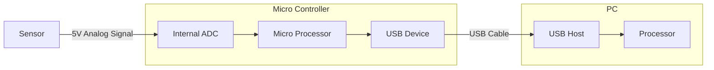

# Overview
The goal of this project is to provide an approachable path to building a hydraulic brake and pedal setup. The goals for the project include:

1. Total cost of the pedal setup should not exceed $500
2. The mechanical elements should be clearly documented and easy to assemble
3. The software and electrical elements should be clearly documented and easy to assemble and modify
    - The SW should be modular and well documented
    - The electrical hardware and wiring should be well documented

Given these goals, the project can be broken into two major areas:
* Mechanical
* Electronics

# Mechanical

# Electronics
The electronics in a DIY pedal system are not very complex, yet most tutorials found online in my opinion do not provide enough insight for a novice to get their bearings. For this project, addressing this issue was a primary goal.

## Technical Background
The following diagram show the major pieces used by any pedal system. In general you have a sensor that measures some physical property (e.g. pressure or position) and outputs an analog signal that is then periodically sampled by an Analog to Digital Converter (ADC). The ADC is then read by a microprocessor which places that value in the USB Device logic. Finally the USB Host periodically checks the device for the latest reading and provides that to the PC Processor.

While all of the above blocks are separate in function, may available parts combine them into neat little packages. For example, the following show how a Micro Controller (e.g. Arduino) has an ADC, a processor, and USB Device logic all in one nice package while your standard PC has both a processor and a USB Host:

As you can see, once we know the Micro Controller provides several parts of the signal chain all in one nice package, there are really only three elements to the system: A sensor, the micro controller, and the PC. Since the PC part is likely taken care of, we only really need to select a sensor and micro controller for our pedals.

### Sensors
To select a sensor, first you have to know what you want to sense. From driving real cars, we have intuitively come to expect the pedals to provide us the following feedback:
<table style="border:1px solid black;margin-left:auto;margin-right:auto;">
  <tr>
    <th>Pedal</th>
    <th>Sense</th>
    <th>Reasoning</th>
  </tr>
  <tr>
    <td>Accelerator</td>
    <td>Position</td>
    <td>How much gas, from no gas to full gas, we are giving the engine?</td>
  </tr>
  <tr>
    <td>Brake</td>
    <td>Pressure</td>
    <td>How hard we are applying the brakes?</td>
  </tr>
  <tr>
    <td>Clutch</td>
    <td>Position</td>
    <td>Where in relation to the flywheel is the clutch?</td>
  </tr>
</table>

As we can see, we need to be able to sense position and pressure. Within these categories there are a few different types of common sensors we can use:

<table style="border:1px solid black;margin-left:auto;margin-right:auto;">
  <tr>
    <th>Sensor Category</th>
    <th>Sensor Type</th>
    <th>Pros</th>
    <th>Cons</th>
    <th>Example</th>
    <th>How it Works</th>
  </tr>
  <tr>
    <td rowspan="2">Position</td>
    <td>Resistive</td>
    <td>Cheap</td>
    <td>Moving parts in sensor wear out</td>
    <td>Most sim Pedals (accelerator, brake, and clutch)</td>
    <td>Input movement changes how much resistance the sensor has and therefore how much voltage is allow through the sensor to the output</td>
  </tr>
  <tr>
    <td>Hall Effect (Magnetic)</td>
    <td>No moving parts in sensor</td>
    <td>More expensive</td>
    <td>Sim accelerator pedal upgrade kits, sim shifters, production car accelerator pedals</td>
    <td>Input movement changes the position of a magnet relative to the Hall sensor and therefore how much voltage the Hall sensor allows through it to the output.</td>
  </tr>
  <tr>
    <td rowspan="2">Pressure</td>
    <td>Hydraulic</td>
    <td>No moving parts in sensor</td>
    <td>More expensive, Requires a pressurized system</td>
    <td>High end sim brake pedals, production car brake system</td>
    <td>Hydraulic fluid presses on a diaphragm and therefore adjusts how much voltage can flow through the sensor to the output</td>
  </tr>
  <tr>
    <td>Load Cell</td>
    <td>No moving parts in sensor</td>
    <td>More expensive</td>
    <td>Sim brake pedal upgrade kits, weight scales</td>
    <td>Mechanical pressure on the sensor adjusts how much voltage can flow through the sensor to the output</td>
  </tr>
</table>

***

**The key takeaway is that there are several options for sensing both position and pressure, which is useful as an ideal pedal system would use these types of sensor for the following**

## Parts Selection
In that spirit, anyone looking to build a DIY pedal system, has several approaches they can uses as the basis for the electronics. The following were considered for this project:
<table style="border:1px solid black;margin-left:auto;margin-right:auto;">
  <tr>
    <th>Approach</th>
    <th>Pros</th>
    <th>Cons</th>
  </tr>
  <tr>
    <td><a href="https://www.leobodnar.com/shop/index.php?main_page=product_info&products_id=204">Leo Bodner 12-Bit Joystick Controller</a></td>
    <td><ul><li>Ready made solution (takes 5 volt inputs)</li><li>12-Bit resolution gives 4096 steps</li></ul></td>
    <td><ul><li>Expensive ($40-$50 USD)</li><li>Hard to find in the US</li><li>Reporting rate (i.e. USB Polling rate) is not advertised, possibly limited to 125Hz</li><li>Cannot be tuned to maximize resolution </li></ul></td>
  </tr>
  <tr>
    <td><a href="https://www.adafruit.com/product/3677">Arduino (5 volt, 32u4 based)</a></td>
    <td><ul><li>Cheap ($10 USD)</li><li>Readily available</li><li>Moderately tunable</li><li>32u4 chips have native USB</li></ul></td>
    <td><ul><li>10-bit resolution gives only 1024 steps</li><li>Soldering required</li></ul></td>
  </tr>
  <tr>
    <td><a href="https://www.adafruit.com/product/3677">Arduino (5 volt, 32u4 based</a> + <a href="https://www.adafruit.com/product/1083">ADS1015 ADC</a></td>
    <td><ul><li>Readily available</li><li>12-Bit resolution gives 4096 steps</li><li>Highly tunable to maximize resolution</li><li>32u4 chips have native USB</li></ul></td>
    <td><ul><li>Moderately priced ($15-$30 USD)</li><li>Circuitry is more complex (e.g. differential inputs)</li><li>Soldering required</li></ul></td>
  </tr>
</table>

**With these options in mind, this project opts for the `Arduino + ADS1015 ADC` approach as it provides the most flexibility. This approach is also the hardest to implement so documenting that approach should provide enough insight to be able to implement the other approaches.**

[View In Mermaid Live Editor](https://mermaid-js.github.io/mermaid-live-editor/#/edit/eyJjb2RlIjoiZ3JhcGggTFJcbiAgICBicmFrZXNbXCJCcmFrZSBQcmVzc3VyZSBTZW5zb3JcIl0gLS0gNVYgQW5hbG9nIFNpZ25hbCAtLT4gQURDMVtcIkFEUzEwMTUgQURDXCJdXG4gICAgdGhyb3R0bGVbXCJUaHJvdHRsZSBQb3NpdGlvbiBTZW5zb3JcIl0gLS0gNVYgQW5hbG9nIFNpZ25hbCAtLT4gQURDMltcIkFEUzEwMTUgQURDXCJdXG4gICAgY2x1dGNoW1wiQ2x1dGNoIFBvc2l0aW9uIFNlbnNvclwiXSAtLSA1ViBBbmFsb2cgU2lnbmFsIC0tPiBBREMyW1wiQURTMTAxNSBBRENcIl1cbiAgICBzdWJncmFwaCAzMnU0IE1pY3JvIENvbnRyb2xsZXJcbiAgICBpbnRlcm5hbC1BRENbXCJJbnRlcm5hbCBBRENcIl0gLS0-IG1pY3JvW1wiTWljcm8gUHJvY2Vzc29yXCJdIC0tPiBkZXZpY2VbXCJVU0IgRGV2aWNlXCJdXG4gICAgZW5kXG4gICAgQURDMSAtLSBJMkMgLS0-IEkyQ3t7STJDIEJ1c319XG4gICAgQURDMiAtLSBJMkMgLS0-IEkyQ1xuICAgIEkyQyAtLT4gbWljcm9cbiAgICBzdWJncmFwaCBQQ1xuICAgIGRldmljZSAtLSBVU0IgQ2FibGUgLS0-IGhvc3RbXCJVU0IgSG9zdFwiXSAtLT4gcGNbXCJQcm9jZXNzb3JcIl1cbiAgICBlbmQiLCJtZXJtYWlkIjp7InRoZW1lIjoiZGVmYXVsdCJ9LCJ1cGRhdGVFZGl0b3IiOmZhbHNlfQ)

[](https://mermaid-js.github.io/mermaid-live-editor/#/edit/eyJjb2RlIjoiZ3JhcGggTFJcbiAgICBicmFrZXNbXCJCcmFrZSBQcmVzc3VyZSBTZW5zb3JcIl0gLS0gNVYgQW5hbG9nIFNpZ25hbCAtLT4gQURDMVtcIkFEUzEwMTUgQURDXCJdXG4gICAgdGhyb3R0bGVbXCJUaHJvdHRsZSBQb3NpdGlvbiBTZW5zb3JcIl0gLS0gNVYgQW5hbG9nIFNpZ25hbCAtLT4gQURDMltcIkFEUzEwMTUgQURDXCJdXG4gICAgY2x1dGNoW1wiQ2x1dGNoIFBvc2l0aW9uIFNlbnNvclwiXSAtLSA1ViBBbmFsb2cgU2lnbmFsIC0tPiBBREMyW1wiQURTMTAxNSBBRENcIl1cbiAgICBzdWJncmFwaCAzMnU0IE1pY3JvIENvbnRyb2xsZXJcbiAgICBpbnRlcm5hbC1BRENbXCJJbnRlcm5hbCBBRENcIl0gLS0-IG1pY3JvW1wiTWljcm8gUHJvY2Vzc29yXCJdIC0tPiBkZXZpY2VbXCJVU0IgRGV2aWNlXCJdXG4gICAgZW5kXG4gICAgQURDMSAtLSBJMkMgLS0-IEkyQ3t7STJDIEJ1c319XG4gICAgQURDMiAtLSBJMkMgLS0-IEkyQ1xuICAgIEkyQyAtLT4gbWljcm9cbiAgICBzdWJncmFwaCBQQ1xuICAgIGRldmljZSAtLSBVU0IgQ2FibGUgLS0-IGhvc3RbXCJVU0IgSG9zdFwiXSAtLT4gcGNbXCJQcm9jZXNzb3JcIl1cbiAgICBlbmQiLCJtZXJtYWlkIjp7InRoZW1lIjoiZGVmYXVsdCJ9LCJ1cGRhdGVFZGl0b3IiOmZhbHNlfQ)